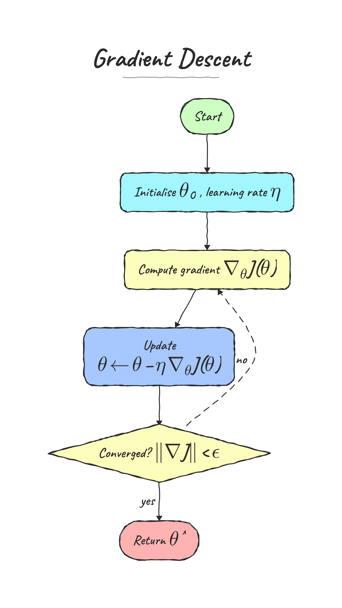
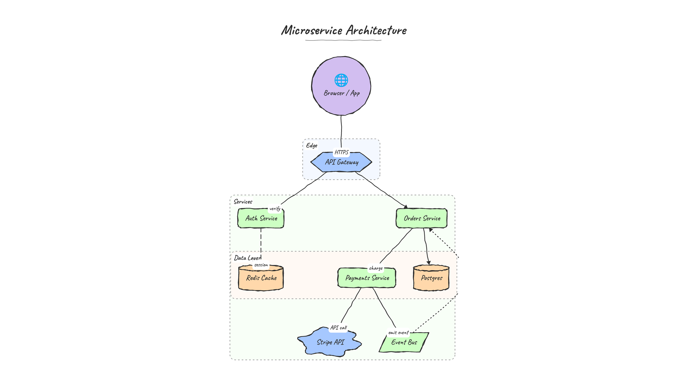

# FlowBlow ✍️

Generate **hand-drawn flow & architecture diagrams** as PNG images, straight
from Python — sketchy borders, the **Caveat** handwriting font, inline
**LaTeX**, and a transparent background by default.

It is **not** limited to traditional flowcharts: because a diagram is just a
directed graph with optional clusters, it can describe architectures, data
pipelines, state machines, mind-maps, anything.

<p align="center">
  
  
</p>

## Highlights

- **Pure Python rendering** — shapes, edges and text are drawn with Pillow
  (no browser/HTML). LaTeX is rasterised by matplotlib's mathtext.
- **Hand-drawn look** — every outline is jittered + double-stroked; node fills
  use a soft pastel palette.
- **Caveat handwriting everywhere**, including LaTeX (the font is embedded, so
  the look needs no network).
- **Automatic layout** — a layered (Sugiyama) engine handles cycles,
  disconnected pieces and long edges; parallel/back edges bow into their own
  arcs; edge labels auto-dodge nodes and group labels.
- **Fills the frame** — the diagram is laid out in whichever orientation best
  fills the output frame (defaults to **9:16 portrait**).
- Shapes: rect, rounded, stadium, ellipse, circle, diamond, hexagon,
  parallelogram, cylinder (DB), cloud, note. Edge styles: solid/dashed/dotted,
  optional emoji icons, and cluster groups.

## Install

```bash
pip install -r requirements.txt      # Pillow, matplotlib, pydantic (+ fastapi for the API)
```

## Use it

### Python

```python
from flowblow import render_png

render_png({
    "direction": "TB",
    "nodes": [
        {"id": "s", "label": "Start", "shape": "stadium", "color": "#caffbf"},
        {"id": "g", "label": "Compute gradient $\\nabla_\\theta J(\\theta)$"},
        {"id": "c", "label": "Converged? $\\|\\nabla J\\| < \\epsilon$", "shape": "diamond"},
        {"id": "d", "label": "Return $\\theta^{*}$", "shape": "stadium", "color": "#ffadad"},
    ],
    "edges": [
        {"from": "s", "to": "g"},
        {"from": "g", "to": "c"},
        {"from": "c", "to": "g", "label": "no", "style": "dashed"},
        {"from": "c", "to": "d", "label": "yes"},
    ],
}, output="gd.png")        # 1080x1920 transparent PNG by default
```

### Command line

```bash
python -m flowblow examples/architecture.json            # -> examples/architecture.png
python -m flowblow spec.json -o out.png --width 1080 --height 1920
python -m flowblow spec.json --html -o out.html          # standalone HTML (MathJax)
python -m flowblow spec.json --opaque                     # paper background
```

### HTTP API

```bash
uvicorn flowblow.api:app --reload
# GET  /                      interactive playground
# POST /render                -> image/png   (?width=&height=&scale=&transparent=)
# POST /render.html           -> standalone HTML
# GET  /examples/{name}.png   -> a bundled example
```

Full API reference: **[docs/api.md](docs/api.md)**.

### Deploy to Google Cloud Run

A ready-to-use [`Dockerfile`](Dockerfile) is included (bundles the fonts,
matplotlib, and warms caches). One command:

```bash
gcloud run deploy flowblow --source . --region us-central1 \
  --allow-unauthenticated --memory 2Gi --cpu 2 --concurrency 8
```

Full guide (recommended settings, auth, CI): **[docs/deploy.md](docs/deploy.md)**.

## Diagram spec

| field        | meaning |
|--------------|---------|
| `direction`  | `TB` / `BT` / `LR` / `RL` (auto-rotated to best fill the frame) |
| `nodes[]`    | `id`, `label`, `shape`, `color`, `group`, `icon` |
| `edges[]`    | `from`/`to` (or `source`/`target`), `label`, `style`, `color`, `bidirectional` |
| `groups[]`   | `id`, `label`, `color` — laid out as disjoint labelled clusters |
| `font_size`  | base size (default 40); plus `accent`/`paper` colours |

Labels may contain inline LaTeX in `$...$` or `$$...$$`. Edges labelled `yes`/`no`
render as a big green **Y** / red **N**. Full reference: **[docs/spec.md](docs/spec.md)**.

## Rendering options (`render_png`)

`width`, `height` (default `1080x1920` = 9:16), `scale` (pixel multiplier,
default 2 → 2160×3840), `transparent` (default `True`), `pad_frac`,
`supersample`.

## Notes

- LaTeX: Latin letters, digits and operators render in Caveat; symbols Caveat
  lacks (Greek, ∇, ‖, …) fall back to a math font so they still render.
- Emoji icons need a system colour-emoji font (e.g. Noto Color Emoji); if none
  is present the icon is simply omitted.
- A standalone HTML renderer (`render_html`) is also available — it uses MathJax
  via CDN and is handy for live/scalable embedding.

## Documentation

- **[docs/spec.md](docs/spec.md)** — full diagram spec (nodes, edges, groups, shapes, LaTeX)
- **[docs/api.md](docs/api.md)** — HTTP API reference
- **[docs/deploy.md](docs/deploy.md)** — deploying to Google Cloud Run

## How it works

1. **Measure** every node with real font metrics (text + LaTeX + emoji).
2. **Layout** with a layered (Sugiyama) engine; clusters are laid out as
   self-contained units and arranged as disjoint regions.
3. **Route** edges around node boxes (visibility graph) and away from each
   other (crossing-penalised), so lines don't pass behind nodes or cut across.
4. **Draw** with Pillow: hand-drawn (jittered, double-stroked) shapes, the
   Caveat font, composited LaTeX, scaled to fill the frame.

## Tests

```bash
python -m pytest -q          # or:  python tests/test_flowblow.py
```
